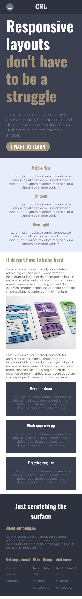
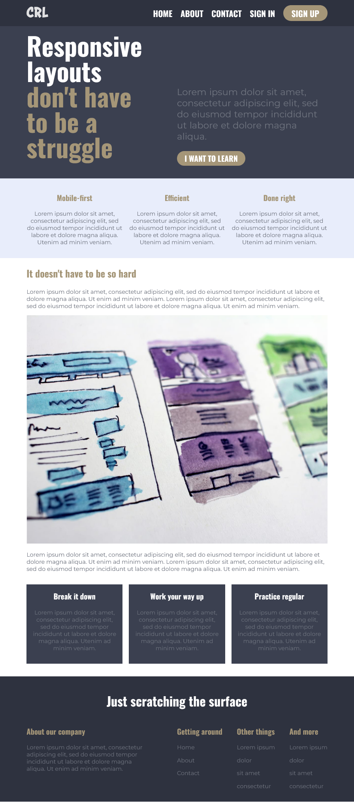
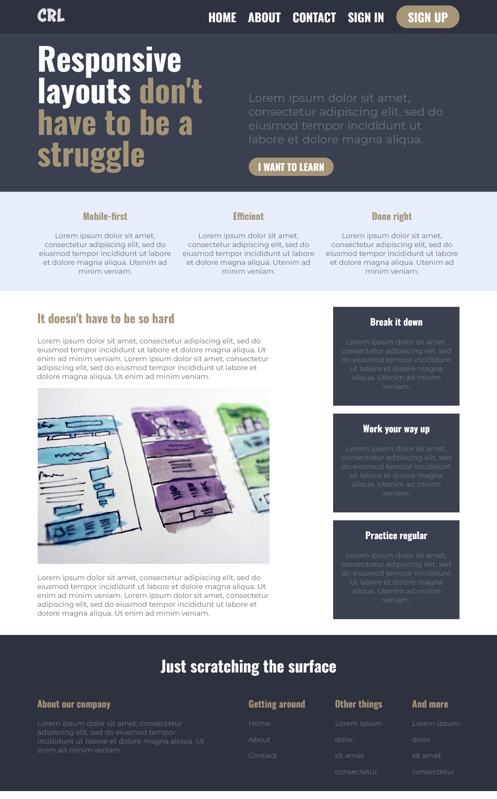

# Responsive Web Layout

This is a solution to the [Kevin Powell's Conquering Responsive Layout final challenge](https://courses.kevinpowell.co/view/courses/conquering-responsive-layouts).  

## Table of contents

- [Overview](#overview)
  - [The challenge](#the-challenge)
  - [Screenshot](#screenshot)
  - [Links](#links)
- [My process](#my-process)
  - [Built with](#built-with)
  - [What I learned](#what-i-learned)
  - [Continued development](#continued-development)
  - [Useful resources](#useful-resources)
- [Author](#author)

## Overview

### The challenge

Site should be completly responsive at different screen sizes.
- Mobile Layout (375px)
- Tablet Layout (1000px)
- Desktop Layout (1200px)

### Screenshot

### Links

- Solution URL: [Github](https://github.com/Raunak40/Responsive_Web_Layout)
- Live Site URL: [shimmering-squirrel-76974c](https://shimmering-squirrel-76974c.netlify.app)

## My process

### Built with

- Semantic HTML5 markup
- CSS custom properties
- Flexbox
- CSS Animation
- Mobile-first workflow
- Javascript

### What I learned

During this challenge I learned some basic CSS animations like transition and translate. I used some semantic HTML tags and also understood the importance of Mobile-first workflow.

### Continued development

I think this site is completed but I wil improve it when I will learn more advanced methods and tricks. I will also improve this site with the help of feedbacks, so feel free to fork some improvments.

### Useful resources

- [W3Schools](https://www.w3schools.com) - This site is all in one solution for any programming related queries.
- [Kevin Powell](https://courses.kevinpowell.co/view/courses/conquering-responsive-layouts) - This course helped me to learn a lot of things necessary for a responsive web layout and this is absolutely free. I'd recommend it to anyone who is trying to learn Resonsive Layouts concept.

## Author

- Website - [Raunak Raj](https://shimmering-squirrel-76974c.netlify.app)
- Frontend Mentor - [@Raunak40](https://www.frontendmentor.io/profile/Raunak40)